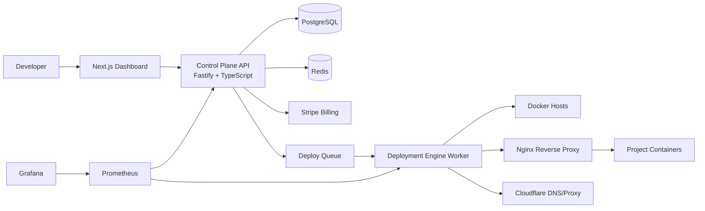
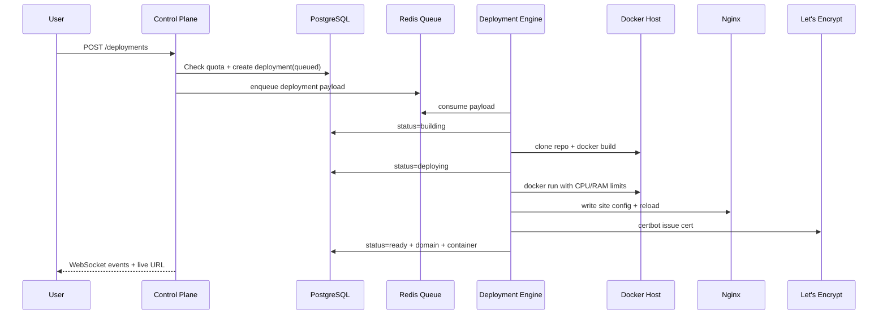

# Apployd Architecture

## High-level

## Deployment Pipeline

## Resource Pooling Rules

- Subscription defines total pool: RAM, CPU, bandwidth.
- Each project can allocate at most 50% of each pool.
- Sum(project allocations) cannot exceed pool.
- Free plan projects default to auto-sleep (15 minutes idle).
- Wake endpoint targets cold-start under 15 seconds.

## Reliability Hardening

- Deployment API supports `Idempotency-Key` to prevent duplicate deploy execution.
- Deployment worker uses Redis lock per deployment id to avoid concurrent duplicate processing.
- Stripe webhook events are deduplicated in `webhook_events` before state mutation.

## Scaling Path

- Phase 1: single server, one Docker host + one Nginx.
- Phase 2: multiple servers, scheduler chooses healthiest capacity candidate.
- Phase 3: enterprise controls (regional failover, dedicated nodes, SOC2 hardening).
- Kubernetes-ready path: deployment engine adapters can be replaced by K8s adapter while API contracts remain stable.
